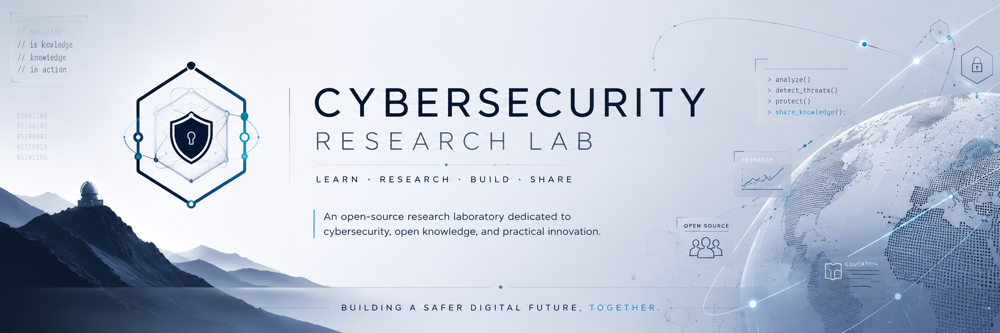

<p align="center">
  
</p>

# 🐧 Linux Roadmap

> **A structured, open-source roadmap for mastering Linux with a focus on cybersecurity, system administration, and practical command-line skills.**

<p align="center">


\

</p>

---

#  About

Linux is one of the most important technologies in modern computing. It powers servers, cloud infrastructure, cybersecurity platforms, embedded systems, and countless enterprise environments.

Despite the abundance of learning resources available online, many learners struggle because tutorials are often fragmented, assume prior knowledge, or focus on memorizing commands instead of understanding concepts.

**Linux Roadmap** was created to provide a complete, structured learning experience that combines theory, practical exercises, troubleshooting, and real-world examples. The objective is not only to teach Linux commands, but to build the confidence required to work with Linux in professional environments.

---

#  What Makes This Roadmap Different?

Unlike traditional tutorials, this roadmap is designed around practical learning.

✔ Structured learning path from beginner to advanced

✔ Hands-on laboratories

✔ Real-world cybersecurity examples

✔ Beginner troubleshooting guides

✔ Common mistakes and how to solve them

✔ Practical exercises after every chapter

✔ Quick-reference cheat sheets

✔ Open-source and community-driven

---

#  Who Is This For?

This roadmap is designed for:

* Computer Science students
* Cybersecurity students
* Self-taught learners
* System administrators
* DevOps beginners
* IT professionals transitioning to Linux
* Anyone starting their Linux journey

No previous Linux experience is required.

---

# 🎓 Learning Objectives

By completing this roadmap, you will be able to:

- Navigate Linux confidently
- Understand how Linux works internally
- Manage files and directories efficiently
- Work with users, permissions, and groups
- Understand Linux networking fundamentals
- Use SSH securely
- Write basic Bash scripts
- Troubleshoot common Linux issues
- Prepare for cybersecurity tools such as Wazuh, Zeek, Suricata, Security Onion, and many others

---

# 🗺️ Learning Progress

## 🟢 Foundations

- [ ] Introduction to Linux
- [ ] Installing Linux
- [ ] Terminal Basics
- [ ] Linux File System
- [ ] File & Directory Management
- [ ] Text Editors

## 🟡 Intermediate

- [ ] Users & Groups
- [ ] Linux Permissions
- [ ] Processes
- [ ] Services
- [ ] Package Managers
- [ ] Networking
- [ ] SSH

## 🔴 Advanced

- [ ] Bash Scripting
- [ ] System Logs
- [ ] Automation
- [ ] Linux Security
- [ ] Linux for Cybersecurity

---

# ⏱️ Estimated Study Time

| Learning Pace             | Estimated Duration |
| ------------------------- | ------------------ |
| Intensive (2–3 hours/day) | 4–6 weeks          |
| Regular (1 hour/day)      | 2–3 months         |
| Casual (3–4 hours/week)   | 4–6 months         |

> Actual learning time depends on prior experience and the amount of hands-on practice completed.

---

# 📂 Repository Structure

```text
linux-roadmap
│
├── README.md
├── ROADMAP.md
├── CONTRIBUTING.md
├── LICENSE
│
├── docs/
├── labs/
├── cheatsheets/
├── troubleshooting/
├── examples/
└── resources/
```

---

#  Learning Philosophy

Learning Linux is more than memorizing commands.

Every chapter in this roadmap follows the same educational structure:

*  Understand the concept
*  Practice using real examples
*  Learn common mistakes
*  Troubleshoot real problems
*  Test your knowledge
*  Apply what you've learned

Our goal is to help learners understand **why** Linux works the way it does—not just **which command** to type.

---

#  Getting Started

We recommend following the roadmap in order.

1. Read each chapter in **docs/**
2. Complete the practical exercises
3. Finish the corresponding lab
4. Review the cheat sheet
5. Use the troubleshooting guide whenever you encounter an issue
6. Move on to the next chapter only after completing the previous one

---

#  Contributing

Contributions are always welcome.

Whether you want to improve documentation, report mistakes, add exercises, create labs, or suggest better explanations, your contribution helps make this roadmap more valuable for everyone.

Please read **CONTRIBUTING.md** before opening an issue or submitting a pull request.

---

# 📄 License

This project is licensed under the **MIT License**.

See the **LICENSE** file for more information.

---

# ⭐ Support the Project

If this roadmap helped you:

* ⭐ Star the repository
* 📢 Share it with others
* 🤝 Contribute improvements
* 💙 Help make Linux education accessible to everyone

---

<p align="center">

**Cybersecurity Research Lab**

*Learn. Research. Build. Share.*

</p>
